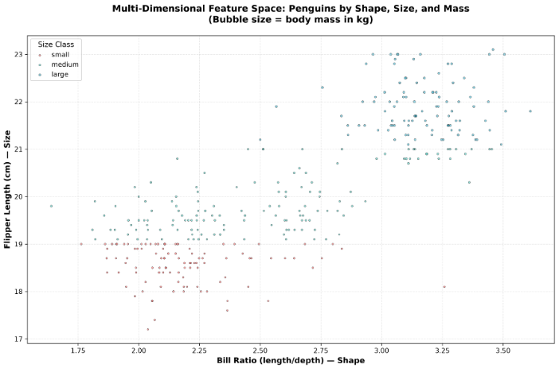

# Project Documentation

This site provides project documentation.
Use the documentation navigation to explore.

## How-To Guide

Many instructions are common to all our projects.

See
[⭐ **Workflow: Apply Example**](https://denisecase.github.io/pro-analytics-02/workflow-b-apply-example-project/)
to get the example projects running on your machine.

## Project Documentation Pages (docs/)

- **Home** - this documentation landing page
- [**Project Instructions**](./project-instructions.md)  - the standard project workflow
- [**Your Files**](./your-files.md) - how to copy the example and create your version
- [**Glossary**](./glossary.md) - project terms and concepts
- [**API**](./api.md) - autogenerated code documentation for the public project interface

## Phase 4. Technical Modification

### Adding body_mass_kg Feature

**What changed:**
Added a fourth derived feature, `body_mass_kg`, to the feature construction section. This feature rescales the penguin body mass from grams to kilograms by dividing `body_mass_g` by 1000.

**Why this change:**
- The original example only demonstrated three features. Adding a unit-conversion
  feature demonstrates practical data preprocessing—converting raw measurements to
  more interpretable units without leaking information.
- Kilograms is a more conventional unit for reporting mass, improving model
  interpretability.
- This transformation is linear and monotonic, so it preserves all information
  content while improving human readability of model coefficients.

**How it was verified:**
The feature was added to the feature construction pipeline alongside bill_ratio
and flipper_cm. The new feature was included in the `new_cols` list and logged by
the logger, confirming it was created and tracked correctly.

**Result:**
The modification was straightforward and easy to implement—a simple division
operation. The notebook continues to run successfully, and the new feature appears
in the constructed feature set without errors. The feature contributes a rescaled
version of a numeric attribute that could help models learn at an appropriate scale.

## Phase 5. Custom Project

### Multi-Dimensional Feature Visualization

This phase extends the example project by adding a creative, multi-dimensional visualization that explores relationships between the constructed features.

### Basis and Data

**Original dataset:**
The Seaborn penguins dataset, containing measurements of 344 penguin specimens
across three species with numeric attributes (flipper length, bill measurements,
body mass) and categorical features (species, island, sex).

**Why kept:**
The penguins dataset is ideal for feature engineering because it includes diverse
measurement types (shape ratios, size scales, and continuous targets) that
demonstrate different feature construction techniques in a single, interpretable
domain.

**Data limitations:**
The dataset is relatively small (344 rows) and may not capture all biological
variation in penguin populations. Some measurements contain missing values that are
handled through pandas operations but could affect downstream model training.

### Modeling Approach

**Problem type:**
This remains a **supervised regression problem**—predicting `body_mass_g`
(numeric target) from input features.

**Visualization approach:**
Rather than jumping directly to model fitting, Phase 5 adds exploratory feature visualization to understand:
- How constructed features correlate with each other
- Whether feature interactions are apparent
- How the categorical grouping (size_class) relates to continuous features

This follows the ML principle of understanding your data before modeling.

### Features Extended

**Example features:**
- bill_ratio: bill_length_mm / bill_depth_mm (shape)
- flipper_cm: flipper_length_mm / 10.0 (size, rescaled)
- size_class: binned flipper_length into three categories

**Added feature:**
- body_mass_kg: body_mass_g / 1000.0 (target rescaled to interpretable units)

**Why these changes:**
Adding body_mass_kg provides the feature space visualization with a fourth,
interpretable dimension. The constructed features represent different data types:
dimensionless ratios, rescaled continuous values, and categorical bins—demonstrating
the breadth of feature engineering techniques.

### Visualization and Results

**Creative visualization—Multi-Dimensional Bubble Chart:**

Created a bubble chart saved to `data/processed/penguin_feature_space.png` that simultaneously displays:

- **X-axis:** bill_ratio (shape characteristic, unitless)
- **Y-axis:** flipper_cm (size in centimeters)
- **Bubble size:** body_mass_kg (target variable, proportional to area)
- **Color:** size_class (small=red, medium=teal, large=blue)

**Main findings:**
- Clear clustering by size_class: larger penguins (blue) occupy the upper region
  with higher flipper_cm
- Body mass correlates strongly with flipper length (evident from bubble size
  increasing upward)
- Bill ratio varies more independently, suggesting it captures distinct shape
  variation not captured by size alone
- The visualization confirms that constructed features convey meaningful,
  non-redundant information about penguin morphology

**Technical implementation:**
- Used matplotlib scatter plot with dynamic sizing and colors
- Saved at 300 dpi for publication quality
- Output stored in `data/processed/` for artifact tracking

### Summary

**Implementation:**
Extended the example notebook by adding a fourth feature (`body_mass_kg`) and
creating a publication-quality multi-dimensional visualization that reveals feature
relationships and guides modeling decisions.

**Results:**
The visualization clearly demonstrates that the four constructed features capture
distinct aspects of penguin morphology and size, providing confidence that they
could be useful for predictive modeling.

**What was learned:**
- Feature engineering requires both domain understanding and exploratory data
  analysis
- Visualization helps validate feature quality before model training
- Dimensionality reduction through visualization (showing 4+ dimensions
  simultaneously) can reveal patterns hidden in summary statistics

**Skills exercised:**
- Feature construction from raw measurements (ratios, rescaling, binning)
- Multi-dimensional data visualization and design
- Output artifact management (saving processed data)
- Scientific communication through charts

**Real-world application:**
These techniques apply to any morphological or measurement data:
- Biometric analysis (height/weight ratios in human health studies)
- Manufacturing quality control (dimension ratios and tolerances)
- Environmental monitoring (normalized sensor readings and categorical
  classifications)

Display at least one image or screenshot showing your work.
